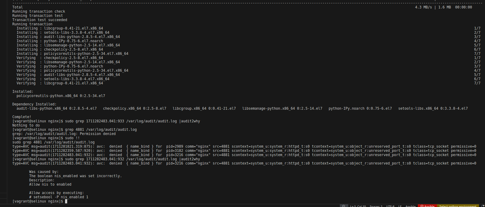
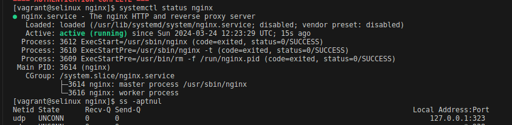
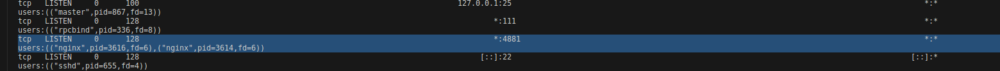
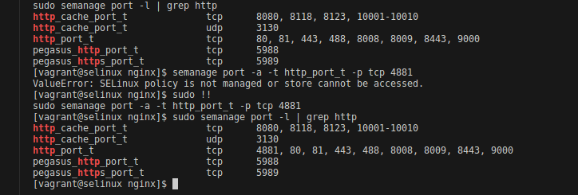
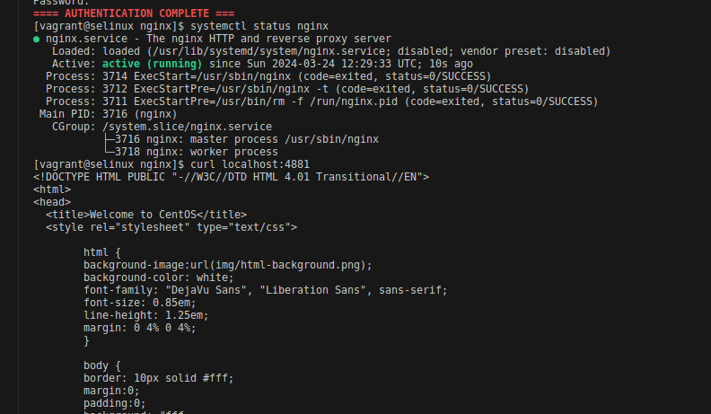
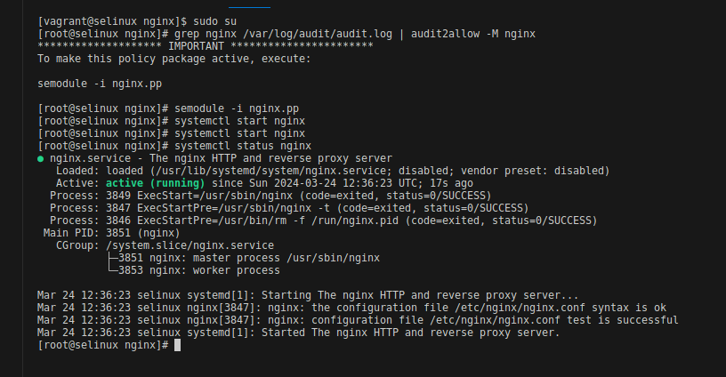
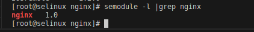

# Task 1
## 1. Способ. Установили флаг setsebool -P nis_enabled 1 

Проверили статус сервиса

Открытый порт 4881

## 2. Способ. Разрешение порта для http трафика с помощью semanage

Проверили статус сервиса

## 3. Способ. Разрешим в SELinux работу nginx на порту с помощью формирования и установки модуля SELinux:

Установленный модуль nginx

